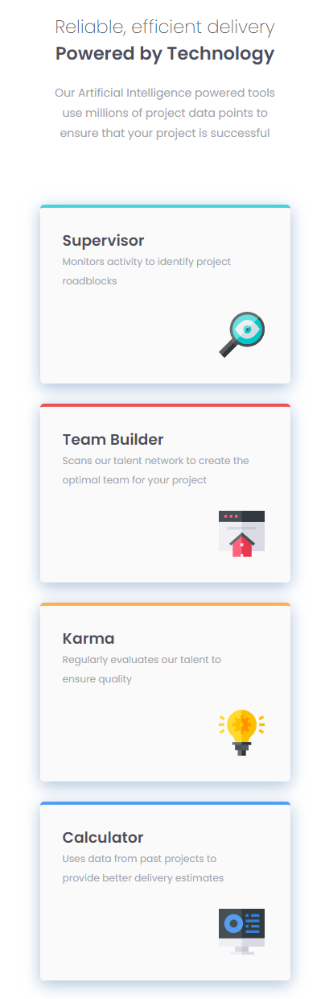

# Frontend Mentor - Four card feature section solution

This is a solution to the [Four card feature section challenge on Frontend Mentor](https://www.frontendmentor.io/challenges/four-card-feature-section-weK1eFYK). Frontend Mentor challenges help you improve your coding skills by building realistic projects. 

## Table of contents

- [Frontend Mentor - Four card feature section solution](#frontend-mentor---four-card-feature-section-solution)
  - [Table of contents](#table-of-contents)
  - [Overview](#overview)
    - [The challenge](#the-challenge)
    - [Screenshots](#screenshots)
      - [Desktop](#desktop)
      - [Mobile](#mobile)
    - [Links](#links)
  - [My process](#my-process)
    - [Built with](#built-with)
    - [What I learned](#what-i-learned)
    - [Code Snippets](#code-snippets)
      - [CSS](#css)
    - [Continued development](#continued-development)
    - [Useful resources](#useful-resources)
  - [Author](#author)

## Overview

### The challenge

Users should be able to:

- View the optimal layout for the site depending on their device's screen size

### Screenshots

#### Desktop


#### Mobile



### Links

- Solution URL: [https://github.com/AlekseiSaunders/fourCardFeatureFM](https://github.com/AlekseiSaunders/fourCardFeatureFM)
- Live Site URL: [https://four-card-feature-fm-alekseisaunders.vercel.app/](https://four-card-feature-fm-alekseisaunders.vercel.app/)
https://github.com/AlekseiSaunders/fourCardFeatureFM

## My process

### Built with

- Semantic HTML5 markup
- CSS custom properties
- Flexbox
- CSS Grid
- Mobile-first workflow
- Figma
- VSCode

### What I learned

I think one thing I really started to utilize in this challenge was bringing Custom Properties into my workflow. I started learning more about these in Josh W. Comeau's CSS course, and another Frontend Mentor/Scrimba challenge, with a video lesson by Kevin Powell. Really interesting to see how he went about planning his flow through the CSS development.

I decided against Utility Classes in this challenge because I thought that might be a bit overkill for a fairly simple design and layout with most elements being reused. 

I also learned that even though you might get a Figma file from the designers, it doesn't mean that everything is going to go smoothly with the development of the HTML and CSS.

### Code Snippets
#### CSS
I liked using Josh's suggestion of matching the box-shadow color to the design element in contrast to just using the default black. It isn't one of the main design colors, but I think it adds a little realism to the shadow drop. Decent box-shadows can be deceptively difficult.
```css
.benefitsBlocks  {
  box-shadow: 0px 5px 20px 0px hsla(212deg, 39%, 66%, 0.7);
}
```

### Continued development

I'd like to get a bit smoother with the Custom Property useage, I think I've got some Custom Properties here that the file doesn't really need, and I retro-fitted this challenge with them. In larger challenges I'll try some Utility Classes, and perhaps try stacked box-shadows ala Josh Comeau's suggestion.

### Useful resources

- [Josh W. Comeau](https://www.joshwcomeau.com/) - Josh explains aspects of CSS that have really clicked with me and I'm finding his CSS course challenging, but well worth the expense for the insight he brings.
- [Kevin Powell goes through his CSS process](https://scrimba.com/learn/spacetravel/introduction-co9754ea5b87864fba221a504) - This is a free tutorial on Scrimba, in conjunction with Frontend Mentor that really clicked with me. I liked Kevin's approach to CSS development and hope to adapt my own flow along these lines.

## Author

- Website - [Aleksei Saunders](https://www.your-site.com)
- Frontend Mentor - [@AlekseiSaunders](https://www.frontendmentor.io/profile/AlekseiSaunders)
- LinkedIn - [Aleksei Saunders](https://www.linkedin.com/in/alekseisaunders/)
  
